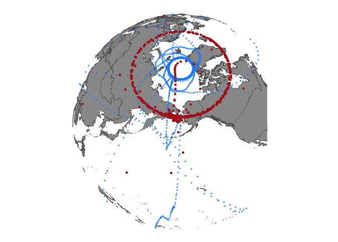

# `aniMotum` tracks crossing the dateline


# Summary of the Issue

Telemetry deployments that cross the dateline (180 longitude) are not
supported by the simulation function `aniMotum::sim_fit()` because the
function presumes coordinates are in Mercator coordinate space. Further,
it seems that only observation data originaly provided as geographic
(lon/lat) is supported by `aniMotum::sim_fit()` and any data provided as
a projected `sf` object (regardless if it spans 180) is not compatible.

# Expected Outcome

Since projected data are supported within the `aniMotum::fit_ssm()` and
the `aniMotum::grab()` functions, I expected those `ssm_df` fit objects
to also be supported within `aniMotum::sim_fit()`. For deployments that
do not cross 180, supplying lon/lat data is a workaround. But, this is
not an option for those that do cross 180.

# Further details

I took some time to look through the code for `aniMotum::sim_fit()` and
it looks like there’s a presumption of Mercator projection throughout.
The CRS of the input data for `aniMotum::fit_ssm()` would need to be
stored in the resulting `ssm_df` for downstream use. Or, possibly
leverage setting `as_sf = TURE` within the `grab()` function at
https://github.com/ianjonsen/aniMotum/blob/7300841984562af373becaaac68789c81e056777/R/sim_fit.R#L143-L149.
It also seems the extent would need to be properly set given the
provided projection and range of data. Lastly, the code for specifying a
`start` and `end` coordinate value would need to support projected
coordinates or, maybe, an `sf_point()`.

# Example code demonstrating the issue

## User-specified projections with `aniMotum::fit_ssm()`

The `aniMotum` package sets a default ‘mercator’ projection which serves
as a sensible spatial projection for many animal telemetry datasets. In
some cases, though, a researcher may want to provide data in a specific,
regional projection. The function `aniMotum::fit_ssm()` can accept an
`sf` object with a specified projection and the model is fit and
predictions are made within this projection.

As an example, here are results from fitting two seal deployments. The
spotted seal (shown in red) has movement that crosses 180 longitude. The
harbor seal (shown in blue), by comparison, does not cross 180.

The data and code are available at
https://github.com/jmlondon/animotum-reprex

Note the observation data are transformed into EPSG:3571 which is a
Bering Sea centric Lambert-Azimuthal Equal Area projection.

``` r
library(dplyr)
library(sf)
library(geoarrow)
library(arrow)
library(aniMotum)

seal_locs <- open_dataset("seal_locs_obs.parquet") |>
  sf::st_as_sf() |>
  sf::st_transform(3571) |>
  dplyr::filter(between(locs_dt, deploy_dt, end_dt)) |>
  dplyr::rename(datetime = locs_dt) |>
  dplyr::mutate(
    quality = case_when(
      type == "FastGPS" ~ "G",
      type == "User" ~ "G",
      .default = quality
    )
  ) |>
  dplyr::filter(!quality %in% c("Z")) |>
  dplyr::select(
    speno,
    deployid,
    species,
    tag_family,
    datetime,
    quality,
    error_semi_major_axis,
    error_semi_minor_axis,
    error_ellipse_orientation,
    error_radius,
    geometry = geom
  )

locs_fit <- aniMotum::fit_ssm(
  x = seal_locs,
  vmax = 8,
  model = "crw",
  time.step = 0.25,
  id = "speno",
  date = "datetime",
  lc = "quality",
  epar = c(
    "error_semi_major_axis",
    "error_semi_minor_axis",
    "error_ellipse_orientation"
  ),
  map = list(psi = factor(NA)),
  tz = "UTC"
)
```

    fitting crw SSM to 2 tracks...

     pars:   1 1 0.05613      
     pars:   1.2355 1.97139 0.08687      
     pars:   1.94201 4.88555 0.17911      
     pars:   2.39732 8.42262 -1.63247      
     pars:   7 15.23687 3.82074      
     pars:   7 17.00405 -6.95172      
     pars:   7 15.82436 0.23945      
     pars:   7 19.41378 -0.2962      
     pars:   7 21.153 2.88906      
     pars:   7 19.42835 0.06642      
     pars:   7 19.78532 0.001      
     pars:   7 20.14762 0.02216      
     pars:   7 20.53345 0.0447      
     pars:   7 21.12549 0.00611      
     pars:   7 21.12549 0.00611      

     pars:   1 1 0.50731      
     pars:   1.28465 1.95385 0.41165      
     pars:   1.95484 4.19961 0.18644      
     pars:   3.94783 5.92221 2.26318      
     pars:   4.88814 9.02709 1.41013      
     pars:   7 10.40314 0.02919      
     pars:   7 13.75106 0.23815      
     pars:   7 15.20025 -2.78709      
     pars:   7 13.89598 -0.06437      
     pars:   7 14.16475 0.13633      
     pars:   7 14.78677 -0.11503      
     pars:   7 15.40219 0.15209      
     pars:   7 16.03876 -0.05973      
     pars:   7 16.70043 0.05109      
     pars:   7 17.36759 -0.01953      
     pars:   7 18.03145 -0.00064      
     pars:   7 18.03145 -0.00064      

``` r
predict_pts <-
  aniMotum::grab(locs_fit, what = "predicted", as_sf = TRUE, group = TRUE) |>
  dplyr::rename(speno = id, datetime = date)

predict_lines <- predict_pts %>%
  dplyr::group_by(speno) %>%
  dplyr::summarise(do_union = FALSE) %>%
  sf::st_cast("LINESTRING")

library(ggplot2)

ggplot() +
  geom_sf(data = seal_locs, color = c("black")) +
  geom_sf(data = predict_lines, color = c("#D81B60", "#1E88E5"))
```


## Simulating tracks leads to unexpected results

Now that we have model fits and predicted tracks, a next step in the
workflow might be to create simulated tracks using the
`aniMotum::sim_fit()` function.

Since the model fits and predictions were in our custom projection, the
initial presumption is that the simulated tracks would also be generated
in the same projection ..

``` r
# now, let's simulate
sim_tracks <- sim_fit(x = locs_fit, what = "predicted", reps = 2)

sim_tracks |> plot()
```


Well, that doesn’t look correct. In fact, if we take a look at the
coordinate data for each seal, we can see things have gotten bungled

``` r
sim_tracks |>
  tidyr::unnest(sims) |>
  dplyr::filter(id == "PL2018_1002", rep == 0) |>
  head()
```

    # A tibble: 6 × 8
      id          model   rep date                  lon   lat       x         y
      <chr>       <chr> <dbl> <dttm>              <dbl> <dbl>   <dbl>     <dbl>
    1 PL2018_1002 crw       0 2018-04-10 00:07:00  13.8   -90 562581. -2985632.
    2 PL2018_1002 crw       0 2018-04-10 00:22:00  16.4   -90 562873. -2985272.
    3 PL2018_1002 crw       0 2018-04-10 00:37:00  18.8   -90 563148. -2985052.
    4 PL2018_1002 crw       0 2018-04-10 00:52:00  18.4   -90 563103. -2985452.
    5 PL2018_1002 crw       0 2018-04-10 01:07:00  16.3   -90 562866. -2984648.
    6 PL2018_1002 crw       0 2018-04-10 01:22:00  13.5   -90 562555. -2982027.

``` r
sim_tracks |>
  tidyr::unnest(sims) |>
  dplyr::filter(id == "PV2015_1008", rep == 0) |>
  head()
```

    # A tibble: 6 × 8
      id          model   rep date                  lon   lat       x         y
      <chr>       <chr> <dbl> <dttm>              <dbl> <dbl>   <dbl>     <dbl>
    1 PV2015_1008 crw       0 2015-09-09 02:27:00  44.4   -90 926669. -3870982.
    2 PV2015_1008 crw       0 2015-09-09 02:42:00  65.9   -90 929066. -3869823.
    3 PV2015_1008 crw       0 2015-09-09 02:57:00  73.5   -90 929909. -3869311.
    4 PV2015_1008 crw       0 2015-09-09 03:12:00  72.6   -90 929804. -3869281.
    5 PV2015_1008 crw       0 2015-09-09 03:27:00  66.6   -90 929142. -3869639.
    6 PV2015_1008 crw       0 2015-09-09 03:42:00  59.2   -90 928315. -3870292.

The values for the ‘lon’ and ‘lat’ columns are not correct for the
Bering Sea. But, maybe, the ‘x’ and ‘y’ coordinate values are correct?

``` r
sim_tracks |>
  tidyr::unnest(sims) |>
  dplyr::filter(id == "PL2018_1002", rep == 0) |>
  sf::st_as_sf(coords = c("x", "y"), crs = 3571) |>
  sf::st_geometry() |>
  ggplot() +
  geom_sf()
```


Ok, maybe we’re on to something. Let’s do the same for the other reps
(`rep == 0` returns the predicted track only).

``` r
sim_tracks |>
  tidyr::unnest(sims) |>
  dplyr::filter(id == "PL2018_1002", rep %in% 1:2) |>
  sf::st_as_sf(coords = c("x", "y"), crs = 3571) |>
  sf::st_geometry() |>
  ggplot() +
  geom_sf()
```


Well, that didn’t work. The `x` and `y` coordinate values seem to be in
different coordinate reference systems. And, looking at the
`aniMotum::sim_fit()` function code it seems there is a presumption data
are in the Mercator projection.

For the harbor seal, we could transform the data back to geographic
(lon/lat) before fit and prediction. For, spotted seal, transforming to
geographic will cause world wrap issues

## Test with geographic (lon/lat) data

Let’s take a step back in the process and re-fit the harbor seal data
with a geographic (lon/lat) coordinate reference system (EPSG:4326).
Behind the scenes, `aniMotum` will transform the coordinates into the
default Mercator projection before fitting.

``` r
pv_locs_merc <- seal_locs |>
  dplyr::filter(species == "Harbor seal") |>
  sf::st_transform(4326)

pv_locs_fit <- aniMotum::fit_ssm(
  x = pv_locs_merc,
  vmax = 8,
  model = "crw",
  time.step = 0.25,
  id = "speno",
  date = "datetime",
  lc = "quality",
  epar = c(
    "error_semi_major_axis",
    "error_semi_minor_axis",
    "error_ellipse_orientation"
  ),
  map = list(psi = factor(NA)),
  tz = "UTC"
)
```

    fitting crw SSM to 1 tracks...

     pars:   1 1 0.50201      
     pars:   1.01563 1.99495 0.40282      
     pars:   0.59826 2.89617 0.51943      
     pars:   -0.27314 3.22992 0.87898      
     pars:   0.25781 3.18838 0.64738      
     pars:   0.0925 2.78502 0.81361      
     pars:   0.21466 3.08308 0.69077      
     pars:   0.20436 3.11559 0.80769      
     pars:   0.19355 3.14972 0.93046      
     pars:   0.34145 3.05815 1.10954      
     pars:   0.43619 3.13601 1.32702      
     pars:   0.52202 3.09816 1.5584      
     pars:   0.52202 3.09816 1.5584      

Now, let’s try simulating tracks and see what we get

``` r
# now, let's simulate
sim_tracks <- sim_fit(x = pv_locs_fit, what = "predicted", reps = 2)

sim_tracks |> plot()
```


Ok, so that seems to work for the harbor seal. Now, let’s try with the
Spotted seal observations that span 180.

``` r
pl_locs_merc <- seal_locs |>
  dplyr::filter(species == "Spotted seal") |>
  sf::st_transform(4326)

pl_locs_fit <- aniMotum::fit_ssm(
  x = pl_locs_merc,
  vmax = 8,
  model = "crw",
  time.step = 0.25,
  id = "speno",
  date = "datetime",
  lc = "quality",
  epar = c(
    "error_semi_major_axis",
    "error_semi_minor_axis",
    "error_ellipse_orientation"
  ),
  map = list(psi = factor(NA)),
  tz = "UTC"
)
```

    fitting crw SSM to 1 tracks...

     pars:   1 1 -0.01772      
     pars:   1.91822 1.31663 -0.25567      
     pars:   3.51762 1.86815 -0.67015      
     pars:   6.05635 1.65246 0.34284      
     pars:   7 2.15142 -1.47345      
     pars:   7 -0.57448 -1.17803      
     pars:   7 1.0985 -0.90503      
     pars:   7 2.27693 -0.69758      
     pars:   7 5.67723 0.4889      
     pars:   7 10.45906 0.69382      
     pars:   7 10.57225 -4.09105      
     pars:   7 10.47301 0.10379      
     pars:   7 11.05285 -0.00631      
     pars:   7 11.64303 -0.00094      
     pars:   7 12.23224 -0.03502      
     pars:   7 12.23224 -0.03502      

Will the simulation return sensible results?

``` r
# now, let's simulate
sim_tracks <- sim_fit(x = pl_locs_fit, what = "predicted", reps = 2)

sim_tracks |> plot()
```



Alas, no.
